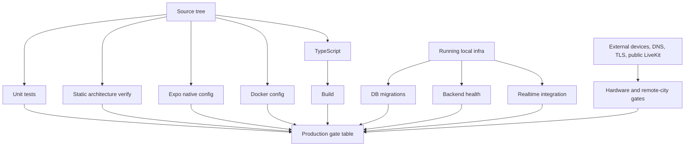

# Final Production Verification

Date: 2026-08-14

## Verification Graph



## Gate Table

| CHECK | STATUS | COMMAND/TEST | RESULT | EVIDENCE | NOTES |
| --- | --- | --- | --- | --- | --- |
| npm installation | PASS | `npm install` | exit 0 | dependencies installed, contracts postinstall build completed | Audit warnings remain separately tracked. |
| npm dedupe | PASS | `npm dedupe` | exit 0 | dependency tree deduped | Audit warnings remain separately tracked. |
| TypeScript | PASS | `npm run typecheck` | exit 0 | mobile, server, contracts typecheck passed | Local deterministic gate. |
| Automated tests | PASS | `npm test` | exit 0 | contracts 1, server 5, mobile 5 passed | Local deterministic gate. |
| Build | PASS | `npm run build` | exit 0 | contracts/server build and mobile typecheck passed | Local deterministic gate. |
| Static architecture verification | PASS | `npm run verify` | exit 0 | 93/93 checks passed | Includes LiveKit init, no emulator fallback, routes, schema, docs. |
| Production verification command | FAIL | `npm run verify:production` | exit 1 | 14/17 checks passed; 1 failed; 2 blocked | Fails on full dependency audit; blocks on physical devices and public staging. |
| Expo Doctor | PASS | `npx expo-doctor` | exit 0 | 21/21 checks passed | Run in `apps/mobile`. |
| Expo production config | PASS | `NODE_ENV=production EXPO_PUBLIC_API_URL=https://api.example.com npx expo config --type public` | exit 0 | cleartext traffic false, Android-only config rendered | Requires real production URL for release. |
| Development Docker config | PASS | `docker compose config` | exit 0 | compose model rendered | Development-only LAN settings are allowed. |
| Development infrastructure | PASS | `docker compose up -d postgres redis livekit && docker compose ps` | exit 0 | Postgres and Redis healthy, LiveKit running | Local infrastructure gate. |
| Database migration from current DB | PASS | `npm run db:migrate` | exit 0 | migrations command completed | Local development DB. |
| Database migration from zero | PASS | temp DB plus `DATABASE_URL=... npm run db:migrate` | exit 0 | V001 through V004 applied | Temporary database was dropped after verification. |
| Backend liveness | PASS | `curl -fsS http://localhost:8080/health/live` | exit 0 | `{"status":"ok"}` | Local backend. |
| Backend readiness | PASS | `curl -fsS http://localhost:8080/health/ready` | exit 0 | `{"status":"ready","database":true,"redis":true}` | Checks Postgres and Redis. |
| Two-device control plane | PASS | `npm run test:integration` | exit 0 | request, accept, credentials, start/end passed | Simulates two devices over local backend/WebSocket. |
| Server production audit | PASS | `npm audit --workspace @portal/server --omit=dev --audit-level=moderate` | exit 0 | found 0 vulnerabilities | Backend production package path. |
| Full dependency audit | FAIL | `npm audit --omit=dev --audit-level=moderate` | exit 1 | Expo/Metro chain reports image-size and uuid advisories | `npm audit fix --force` suggests a breaking Expo change. |
| Production Docker example config | PASS | `PORTAL_PRODUCTION_ENV_FILE=.env.example docker compose --env-file infrastructure/production/.env.example -f infrastructure/production/docker-compose.prod.yml config` | exit 0 | production compose can render with example env | Real production deploy must use `.env`. |
| No committed env secrets | PASS | `git ls-files -- .env '*/.env' '.env.*' '*/.env.*'` | exit 0 | only `.env.example` files are tracked | Current untracked env files remain local. |
| Android Gradle build | PASS | `JAVA_HOME=/usr/lib/jvm/java-17-openjdk-amd64 ANDROID_HOME=/home/kimz/Android/Sdk ANDROID_SDK_ROOT=/home/kimz/Android/Sdk PATH=/home/kimz/Android/Sdk/platform-tools:$PATH ./gradlew assembleDebug` | exit 0 | `BUILD SUCCESSFUL in 13m 40s`; `app-debug.apk` created | Debug APK size: 309 MB. |
| Physical Android device install | BLOCKED | `ANDROID_HOME=/home/kimz/Android/Sdk PATH=/home/kimz/Android/Sdk/platform-tools:$PATH adb devices` | blocked | adb daemon started, but `List of devices attached` was empty | Requires connected physical Android device. |
| Camera permission | BLOCKED | physical Android checklist | blocked | no connected device | Must be verified on real Android. |
| Microphone permission | BLOCKED | physical Android checklist | blocked | no connected device | Must be verified on real Android. |
| Local video publish | BLOCKED | physical Android plus LiveKit logs | blocked | no connected device in this run | Prior logs show past track publish, but this run cannot claim pass. |
| Remote video render | BLOCKED | two physical Android devices | blocked | no second device in this run | Required before release. |
| QR scanning | BLOCKED | physical Android camera QR scan | blocked | no connected device | Static QR scanner exists; hardware behavior must be tested. |
| Public backend reachability | BLOCKED | `curl https://.../health/ready` | blocked | no public staging URL configured | Required before Manila/Lucena testing. |
| Public LiveKit reachability | BLOCKED | WSS/TLS/RTC checks | blocked | no public LiveKit endpoint configured | Required before production. |
| Remote city validation | BLOCKED | two devices on different networks | blocked | no remote devices or public deployment | Final human hardware gate. |

## Final Environment Architecture

Production must be:

```text
Android Portal
  -> HTTPS/WSS public backend
  -> PostgreSQL, Redis, LiveKit API
  -> WSS/WebRTC public LiveKit media endpoint
  -> Android Portal on another internet connection
```

The mobile app receives only public API/LiveKit URLs and short-lived room tokens. `LIVEKIT_API_SECRET` stays server-side.

## Exact Production Deployment Procedure

See `PRODUCTION.md` and `ENVIRONMENT.md`.

## Exact Android Build Procedure

See `PRODUCTION.md`.

## Exact Remote-City Test Procedure

See `ENVIRONMENT.md` and `docs/HARDWARE_ACCEPTANCE.md`.

## Rollback Procedure

See `PRODUCTION.md`.

## Known Limitations

- Production cannot be declared complete until the full dependency audit is resolved or explicitly accepted with documented compensating controls.
- Android debug APK builds locally, but hardware/media gates remain blocked without attached devices.
- Public DNS/TLS/LiveKit staging gates remain blocked without credentials and endpoints.
