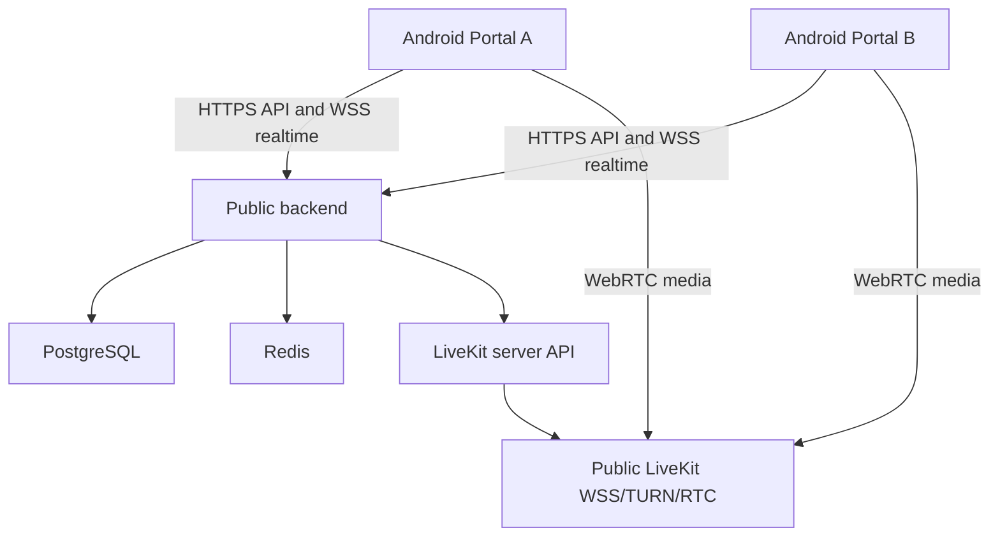

# Production Readiness

## Architecture



Each Android installation represents a place. There are no human accounts, roles, RBAC, followers, friends, feeds, chat, or recording in V1.

## Required Commands

```bash
npm install
npm dedupe
npm run verify
npm run verify:production
npm run typecheck
npm test
npm run build
npm run infra:up
npm run db:migrate
npm run test:integration
```

`npm run verify:production` includes deterministic local production gates and marks external gates as blocked instead of passing them from static checks.

## Deployment Procedure

1. Provision PostgreSQL, Redis, and LiveKit Cloud or self-hosted LiveKit.
2. Configure public DNS and TLS for the API and LiveKit signaling endpoints.
3. Copy `infrastructure/production/.env.example` to `infrastructure/production/.env`.
4. Replace every placeholder secret and domain.
5. Validate configuration:

```bash
PORTAL_PRODUCTION_ENV_FILE=.env docker compose --env-file infrastructure/production/.env -f infrastructure/production/docker-compose.prod.yml config
```

6. Deploy:

```bash
docker compose -f infrastructure/production/docker-compose.prod.yml up -d --build
```

7. Run migrations during server startup or as a controlled release step.
8. Verify:

```bash
curl -fsS https://portal-api.example.com/health/live
curl -fsS https://portal-api.example.com/health/ready
```

## Android Build Procedure

Use an Expo development build for physical testing and an EAS/internal Android release build for production distribution.

```bash
cd apps/mobile
EXPO_PUBLIC_API_URL=https://portal-api.example.com NODE_ENV=production npx expo config --type public
npx expo prebuild --platform android --clean
npx eas build --platform android --profile production
```

The local shell must have JDK, Android SDK, Gradle support, and `adb` before local device install/build validation can pass.

## Rollback Procedure

1. Stop new Android distribution by disabling the latest internal release.
2. Revert the backend image to the previous known-good version.
3. Keep database migrations backward-compatible whenever possible.
4. If a migration is not reversible, restore from a tested PostgreSQL backup.
5. Rotate LiveKit/API secrets only if a secret leak is suspected.
6. Verify `/health/ready`, a two-device request, and LiveKit credentials after rollback.

## Known Production Risks

- Full dependency audit currently reports Expo/Metro-chain advisories in the mobile toolchain. The server production audit is clean.
- Physical Android camera, microphone, QR, lifecycle, and two-way media tests require connected devices.
- Public backend and LiveKit reachability require real DNS, TLS, and staging/production credentials.
- Self-hosted LiveKit needs production network tuning, including UDP buffer settings and TURN/RTC firewall rules.
- Development Compose exposes local Postgres/Redis ports for convenience; do not expose them publicly.
